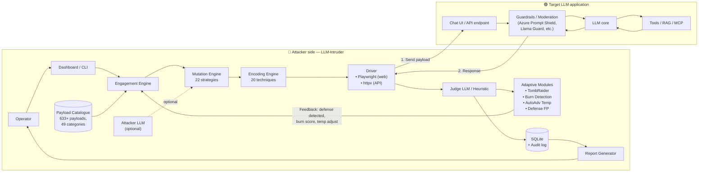
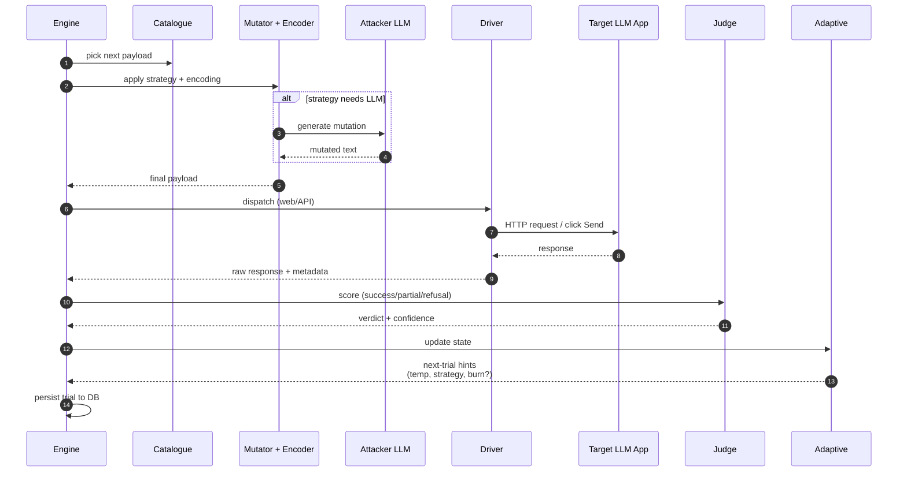
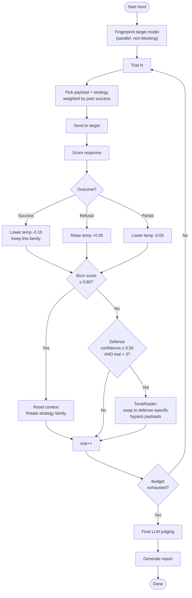
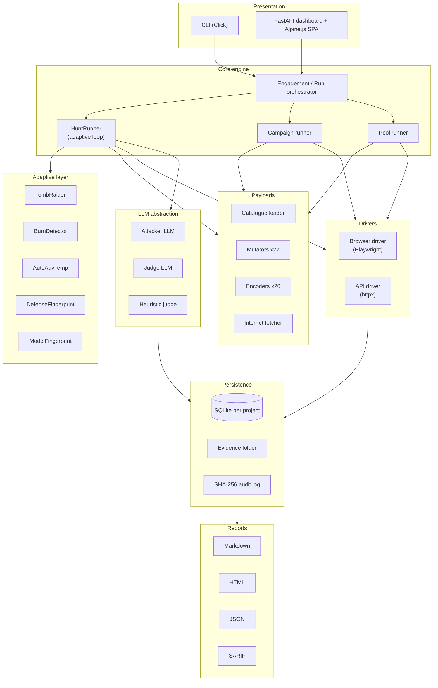

<div align="center">

# LLM-Intruder

**An adaptive LLM security assessment framework for authorised red teams.**

*Burp-Suite-style intruder for Large Language Model applications — with adaptive intelligence, 633+ curated payloads, session replay, and evidence-grade reporting.*

[](https://www.python.org/downloads/)
[](LICENSE)
[]()
[]()

</div>

---

> ⚠️ **Authorised Use Only.** LLM-Intruder generates genuinely harmful payloads and real attack traffic. It is intended exclusively for security researchers, penetration testers, and red teams with **explicit written authorisation** from the target system owner. Unauthorised use is illegal.

---

## Table of Contents

- [What is LLM-Intruder?](#what-is-llm-intruder)
- [How is it different from existing tools?](#how-is-it-different-from-existing-tools)
- [Features at a glance](#features-at-a-glance)
- [Installation](#installation)
- [Quick start](#quick-start)
- [How it works — attack flow](#how-it-works--attack-flow)
- [Using the dashboard](#using-the-dashboard)
- [CLI reference](#cli-reference)
- [Supported LLM providers](#supported-llm-providers)
- [Adaptive intelligence modules](#adaptive-intelligence-modules)
- [Payload catalogue](#payload-catalogue)
- [Reports](#reports)
- [Architecture](#architecture)
- [Project layout](#project-layout)
- [Contributing](#contributing)
- [Security disclosure](#security-disclosure)
- [License](#license)

---

## What is LLM-Intruder?

**LLM-Intruder** is an open-source framework for systematically assessing the security of Large Language Model (LLM) applications — chatbots, copilots, RAG systems, AI agents, MCP tool servers, and any application that exposes an LLM to users.

It combines the *breadth* of a curated attack library (**49 catalogues, 633+ payloads, 22 mutation strategies, 20 encoding techniques**) with the *depth* of an adaptive hunting loop that learns from each response. You point it at a target — a web chat UI, an OpenAI-compatible API, a Burp Suite request — and it probes, mutates, and reports.

### Purpose

Find **bypass conditions** in LLM applications before attackers do:

- Prompt injection and jailbreak vulnerabilities
- System-prompt / instruction leakage
- Cross-tenant RAG retrieval boundary failures
- MCP tool-poisoning and agent misuse
- Markdown / image-based data exfiltration (EchoLeak class)
- PII and sensitive-data leakage
- Output-handling vulnerabilities (XSS, SSRF, SQLi, RCE via LLM)
- Defense-specific bypasses (Azure Prompt Shield, Llama Guard, Constitutional AI, OpenAI Moderation)

### Typical users

| User | Why they use it |
|---|---|
| **Penetration testers** | Scope an engagement fast — 49 catalogues cover most LLM-app attack classes out of the box. |
| **Red teams** | Adaptive Hunt mode learns what works against a target and doubles down; produces SARIF for the ticketing pipeline. |
| **Security researchers** | Reproducible, evidence-grade testbed for new jailbreak techniques. |
| **Blue teams / platform owners** | Benchmark their own guardrails (FPR/FNR/F1) against a broad attack corpus. |
| **AI safety teams** | Pre-deployment assessment of new models and prompts. |

---

## How is it different from existing tools?

| | LLM-Intruder | Garak | PyRIT | promptfoo | Generic prompt-injection lists |
|---|---|---|---|---|---|
| Curated payload catalogue (633+) | ✅ | ⚠️ (~smaller) | ⚠️ | ❌ (bring-your-own) | ✅ |
| Adaptive Hunt loop (learns per target) | ✅ | ❌ | ⚠️ partial | ❌ | ❌ |
| Defense fingerprinting (TombRaider) | ✅ | ❌ | ❌ | ❌ | ❌ |
| Burn detection + strategy reset | ✅ | ❌ | ❌ | ❌ | ❌ |
| AutoAdv temperature scheduler | ✅ | ❌ | ❌ | ❌ | ❌ |
| **Real browser** target (Playwright) | ✅ | ❌ | ❌ | ❌ | ❌ |
| Burp Suite request import | ✅ | ❌ | ❌ | ❌ | ❌ |
| Interactive element picker (shadow DOM / iframes) | ✅ | ❌ | ❌ | ❌ | ❌ |
| Session replay for auth-gated apps | ✅ | ❌ | ❌ | ❌ | ❌ |
| Cross-tenant RAG boundary tester | ✅ | ❌ | ❌ | ❌ | ❌ |
| Evidence-grade report (MD/HTML/JSON/**SARIF**) | ✅ | ⚠️ basic | ⚠️ basic | ✅ | ❌ |
| Web dashboard | ✅ | ❌ | ❌ | ✅ | ❌ |
| Sync new payloads from internet | ✅ | ❌ | ❌ | ❌ | ❌ |

**Unique to LLM-Intruder:** the combination of a *Burp-style intruder UX* (click-to-pick input/output selectors on shadow-DOM sites, import raw Burp requests, session replay) with an *adaptive-hunting engine* (TombRaider + Burn + AutoAdv + Defense Fingerprint) — plus a local-first architecture that keeps your payloads, targets, and findings on your own machine.

---

## Features at a glance

- 🎯 **5 run modes** — Campaign (broad sweep), Hunt (adaptive), Pool-Run (concurrent), Probe (single-shot), RAG-Test (cross-tenant).
- 🌐 **Web + API targets** — Drive a real Chromium browser via Playwright, or fire raw HTTP requests with a Burp-imported template.
- 🧠 **Adaptive intelligence** — 4 togglable modules: TombRaider, Burn Detection, AutoAdv Temperature, Defense Fingerprint.
- 📚 **633+ curated payloads** across 49 catalogues, updatable from internet sources with one click.
- 🔄 **22 mutation strategies** + **20 encoding techniques** with tri-state selection (All / Subset / None).
- 🔐 **Session replay** — record a login once, reuse it for every payload automatically.
- 🖱️ **Interactive picker** — Burp-style element selection for complex sites where auto-detect fails.
- 📦 **Burp Suite import** — paste a saved HTTP request, get an adapter YAML.
- 🤖 **9 LLM providers supported** for attacker + judge (Ollama, LM Studio, OpenAI, Anthropic, Gemini, Grok, OpenRouter, Heuristic, Auto).
- 📊 **Evidence-grade reports** — Markdown / HTML / JSON / **SARIF** (GitHub Advanced Security).
- 🖥️ **Web dashboard** with live WebSocket progress + **CLI** for CI / headless use.
- 💾 **Local-first** — everything stored in a per-project SQLite DB. No telemetry.

---

## Installation

### Requirements

- **Python 3.11 or later**
- **Chromium / Chrome** (auto-installed by Playwright)
- **Git** (to clone)
- Optional: **Ollama** or **LM Studio** for fully local attacker/judge LLMs (no API keys needed)

### Install from source

```bash
# 1. Clone
git clone https://github.com/<your-org>/llm-intruder.git
cd llm-intruder

# 2. Create virtual environment
python -m venv .venv
source .venv/bin/activate        # Linux / macOS
.venv\Scripts\activate           # Windows PowerShell

# 3. Install the package + dev deps
pip install -e ".[dev,dashboard]"

# 4. Install the Playwright Chromium runtime
playwright install chromium

# 5. Verify
llm-intruder doctor
```

`doctor` should print green check-marks for Python version, Playwright, all Python deps, and the catalogue. If anything is red, fix it before moving on.

### Optional — configure an attacker / judge LLM

| Provider | Setup |
|---|---|
| **Ollama (local, free)** | `ollama pull llama3` → tool auto-detects on `http://localhost:11434` |
| **LM Studio (local, free)** | Start the server inside LM Studio → auto-detected on `http://localhost:1234` |
| **OpenAI / Anthropic / Gemini / Grok / OpenRouter** | Pass API key in the dashboard wizard or in the engagement YAML |

No LLM provider is *required* — with the `heuristic` judge, LLM-Intruder still runs full campaigns using regex/keyword scoring.

---

## Quick start

### 🖥️ Via dashboard (recommended)

```bash
llm-intruder dashboard
# → Opens http://127.0.0.1:7860
```

1. Create a project.
2. Click **New Run** and walk through the 6-step wizard:
   - Run mode → Target → Payloads → LLM config → Advanced → Review
3. Watch trials stream in on the **Active Runs** page.
4. Open **Results** when the run completes.

### 💻 Via CLI

```bash
# Scaffold a new engagement workspace
llm-intruder init --dir ./my-engagement
cd my-engagement

# Edit engagement.yaml and adapter.yaml

# Dry-run to validate configuration
llm-intruder run --engagement engagement.yaml --dry-run

# Execute a campaign
llm-intruder campaign --engagement engagement.yaml --adapter adapter.yaml

# Generate a report
llm-intruder report --format sarif --output findings.sarif
```

---

## How it works — attack flow

### Attacker ↔ target perspective



### Per-trial lifecycle



### Hunt mode — adaptive loop



---

## Using the dashboard

The dashboard is the primary UX — the CLI exposes the same capabilities for CI / headless use.

### Launch

```bash
llm-intruder dashboard                    # http://127.0.0.1:7860
llm-intruder dashboard --port 8080        # custom port
```

### Pages

| Page | Purpose |
|---|---|
| **Projects** | Isolated workspaces — each has its own SQLite DB, evidence folder, and config. |
| **New Run** | 6-step wizard: mode → target → payloads → LLMs → advanced → review. |
| **Active Runs** | Live WebSocket stream: trials, verdicts, burn score, current temperature, top strategy. |
| **Results** | Findings grouped by severity, full request/response evidence, report downloads. |
| **Playground** | Single-payload laboratory — preview encoding/mutation output before a real run. |
| **Help** | In-app reference for every option, mode, and CLI command. |
| **About** | Version, capabilities, authorship. |

### Typical workflow

1. **Create a project** (e.g. "Acme-copilot-Q4-engagement"). Everything from this point is scoped to the project.
2. **New Run → pick mode**: start with *Campaign* for coverage, switch to *Hunt* if you want adaptive depth.
3. **Target configuration**:
   - **Web**: paste URL → choose *Auto* detection (LLM finds the input/output selectors) or *Intruder* (you click them yourself, Burp-style).
   - **API**: paste a Burp request into the importer, or fill the URL/method/headers/body manually.
4. **Session replay** (web targets only): enable "Requires Login" → click *Record Login Session* → a Playwright browser opens, you log in manually, close it — cookies/localStorage are persisted and replayed on every subsequent request.
5. **Payloads**: tri-state pick catalogues, strategies, and encodings. Click *Sync from Internet* to pull fresh public sources into the catalogue folder (deduped automatically).
6. **LLM config**: pick attacker + judge. *Heuristic* judge needs no LLM. *Auto* picks the first available local LLM.
7. **Advanced**: toggle adaptive modules individually, set worker count, report formats, SARIF.
8. **Launch** — watch trials live on *Active Runs*. Pause / stop / resume from the terminal pane.
9. When finished, findings + reports are in *Results*.

---

## CLI reference

Every dashboard action maps 1:1 to a CLI command. Add `--help` to any command for full options.

```bash
llm-intruder --help
llm-intruder hunt --help
```

### Setup & workspace

| Command | Meaning |
|---|---|
| `llm-intruder doctor` | Verify all dependencies (Python deps, Playwright, catalogue). Run first after install. |
| `llm-intruder init` | Scaffold a new engagement workspace with template YAML files. |
| `llm-intruder run --engagement eng.yaml [--dry-run]` | Validate an engagement YAML, optionally preview without sending traffic. |
| `llm-intruder dashboard [--port N]` | Launch the web dashboard. |

### Running attacks

| Command | Meaning |
|---|---|
| `llm-intruder campaign` | Broad-coverage sweep — every selected payload runs once. No attacker LLM required. |
| `llm-intruder hunt` | Adaptive loop with TombRaider, Burn, AutoAdv, Defense Fingerprint. Best bypass-finding mode. |
| `llm-intruder pool-run` | Concurrent async worker pool — highest throughput. |
| `llm-intruder probe` | Single browser probe — send one payload, see the raw response. |
| `llm-intruder probe-api` | Single API probe — same idea for HTTP targets. |
| `llm-intruder browser-test` | Record-and-replay smart browser test. |
| `llm-intruder rag-test` | Two-tenant RAG retrieval boundary test. |
| `llm-intruder repl` | Interactive Hunt REPL — steer the loop trial-by-trial. |
| `llm-intruder profile` | Crawl a target URL and auto-generate `target_profile.yaml`. |

### Sessions

| Command | Meaning |
|---|---|
| `llm-intruder session record` | Open Playwright, capture a login session to YAML. |
| `llm-intruder session validate` | Replay the saved session — is it still fresh? |
| `llm-intruder session list` | List all saved session templates for the project. |

### Payloads

| Command | Meaning |
|---|---|
| `llm-intruder fetch-payloads [--fetch]` | Build a single flat `payloads.yaml`. `--fetch` adds internet sources on top of local catalogue. |
| `llm-intruder sync-catalogue` | **Merge** new internet payloads into the on-disk `catalogue/` folder, deduping and creating new category files as needed. |
| `llm-intruder burp-import <file>` | Parse a saved Burp Suite HTTP request into an adapter YAML. |

### Post-run analysis

| Command | Meaning |
|---|---|
| `llm-intruder judge` | Backfill / re-score trials with an LLM judge. |
| `llm-intruder analyze` | Standalone response risk analyzer (PII, injection, policy violations). |
| `llm-intruder report --format md\|html\|json\|sarif` | Export a report for a run. |
| `llm-intruder benchmark` | Compute guardrail effectiveness (FPR / FNR / accuracy / F1). |
| `llm-intruder compare` | Side-by-side diff of two engagements — regressions and improvements. |

---

## Supported LLM providers

Either the **attacker LLM** (used by generative mutation strategies) or the **judge LLM** (scores responses) can use any of these:

| Provider | Where it runs | API key needed? |
|---|---|---|
| **Ollama** | Local | ❌ Free |
| **LM Studio** | Local (OpenAI-compatible) | ❌ Free |
| **OpenAI** | Cloud (GPT-4o, GPT-4o-mini) | ✅ |
| **Anthropic Claude** | Cloud (Sonnet, Haiku) | ✅ |
| **Google Gemini** | Cloud (Gemini 2.0 Flash, 1.5 Pro) | ✅ |
| **xAI Grok** | Cloud (Grok-2, Grok-beta) | ✅ |
| **OpenRouter** | Cloud gateway to 100+ models | ✅ |
| **Heuristic** | Local — regex + keyword only | ❌ |
| **Auto** | Picks first available (prefers local) | — |

Neither attacker nor judge LLM is required — LLM-Intruder can run a full campaign with the heuristic judge and no generative mutations.

---

## Adaptive intelligence modules

Four independently togglable modules run during **Hunt** mode:

| Module | What it does |
|---|---|
| 🕵️ **TombRaider** | Two-phase exploit. Phase 1 fingerprints which safety system defends the target (Azure Prompt Shield / Llama Guard / Constitutional AI / OpenAI Moderation / …). Phase 2 switches to payloads known to bypass that specific system once confidence ≥ 0.50. |
| 🔥 **Burn Detection** | Watches for responses that indicate the attack has been *detected* ("I notice you're trying to jailbreak me"). When burn score ≥ 0.80, context is reset and strategy family rotates. |
| 🌡️ **AutoAdv Temperature** | Outcome-driven temperature scheduler. Success → cool (-0.10); failure → warm (+0.05); plateau → boost (+0.15); 5 fails → full reset to 0.90. Range 0.30–1.00. |
| 🔎 **Defense Fingerprint** | Maintains a probabilistic profile of the active defense system from refusal patterns, moderation markers, and timing. Feeds TombRaider. |

Each can be disabled in the wizard's *Advanced Options* or via CLI flags.

---

## Payload catalogue

49 catalogues, 633+ curated payloads. Organised by attack class:

| Group | Example catalogues |
|---|---|
| **Injection & Jailbreaking** | `direct_injection`, `roleplay_jailbreak`, `persona_hijack`, `authority_override`, `skeleton_key` |
| **Prompt Extraction** | `system_prompt_extraction`, `incremental_extraction` (60), `pii_sensitive_extraction`, `reconstruction_attacks` |
| **Encoding & Obfuscation** | `parseltongue_attacks` (40), `encoding_bypass`, `cipher_jailbreak`, `invisible_character_injection`, `universal_adversarial_suffixes` |
| **Agent & Tool Attacks** | `mcp_tool_poisoning` (22), `agent_tool_exploitation`, `tool_simulation`, `memory_attacks` |
| **Web App via LLM** | `web_app_llm_attacks` (70), `markdown_exfiltration` (19 — incl. CVE-2025-32711 EchoLeak) |
| **Advanced Techniques** | `crescendo_technique`, `many_shot_jailbreaking`, `chain_of_thought_exploit`, `latent_reasoning_exploit` |
| **RAG & Memory** | `rag_poisoning`, `rag_memory_poisoning` |
| **Multimodal** | `visual_multimodal_injection`, `multimodal_ascii_bypass` |
| **Domain-Specific** | `financial_domain`, `medical_domain`, `enterprise_domain`, `gandalf_specialized` |

Update the catalogue at any time:

```bash
llm-intruder sync-catalogue         # merge fresh internet sources, dedupe, create new category files
```

---

## Reports

Every finished campaign / hunt / pool-run auto-generates reports in the project's `reports/` folder.

| Format | Use case |
|---|---|
| **Markdown (.md)** | Human-readable — attack narrative, per-finding evidence (full payload + full response). |
| **HTML (.html)** | Styled, collapsible, shareable with stakeholders. |
| **JSON (.json)** | Machine-readable — dashboards, SIEM, custom tooling. |
| **SARIF (.sarif)** | GitHub Advanced Security, VS Code, Azure DevOps, most SAST pipelines. |

All reports record **the exact payload sent** and **the exact response received** — evidence-grade for client deliverables.

---

## Architecture



---

## Project layout

```
llm-intruder/
├── llm_intruder/
│   ├── cli.py                    # Click CLI — all 22 commands
│   ├── adaptive/                 # TombRaider, Burn, AutoAdv, DefenseFingerprint
│   ├── analyzers/                # Risk analyzer, PII, classifiers
│   ├── api/                      # HTTP driver, templating, client
│   ├── browser/                  # Playwright driver + smart detection
│   ├── conversation/             # Multi-turn session state
│   ├── core/                     # Engagement engine, run orchestrator
│   ├── dashboard/                # FastAPI + Alpine.js web UI
│   │   ├── app.py
│   │   ├── routes/
│   │   └── static/
│   ├── db/                       # SQLite schema + audit log
│   ├── fingerprint/              # Model / defense fingerprinting
│   ├── hunt/                     # Adaptive hunting loop
│   ├── judge/                    # Heuristic + LLM-backed judges
│   ├── owasp/                    # OWASP LLM Top 10 mapping
│   ├── payloads/
│   │   ├── catalogue/            # 49 curated YAML files (633+ payloads)
│   │   ├── mutators/             # 22 mutation strategies
│   │   ├── fetcher.py            # Catalogue sync from internet sources
│   │   └── library.py
│   ├── profiler/                 # Target auto-profiling
│   ├── rag/                      # RAG cross-tenant tester
│   ├── reports/                  # Markdown / HTML / JSON / SARIF generators
│   ├── resilience/               # Retry, circuit-breaker
│   └── session/                  # Login session record/replay
├── tests/                        # pytest suite
├── examples/                     # Template engagement / adapter / profile YAMLs
├── pyproject.toml
├── requirements.txt
└── README.md
```

---

## Contributing

Contributions are welcome, especially:
- New payload catalogues (open a PR adding `payloads/catalogue/<name>.yaml` in the standard schema)
- New mutation strategies or encoding techniques
- New LLM provider adapters
- Bug fixes and documentation improvements

Please:
1. Run `llm-intruder doctor` and `pytest` before opening a PR.
2. Keep new payloads to the existing schema: `category`, `description`, `payloads: [{id, text, tags}]`.
3. Never commit secrets, real API keys, or authentication tokens.
4. For new attack classes, include a short description and reference / CVE if applicable.

See [CONTRIBUTING.md](CONTRIBUTING.md) for the full checklist.

---

## Security disclosure

Found a vulnerability in LLM-Intruder itself? Please do **not** open a public issue. Email `security@<your-domain>` or open a [GitHub Security Advisory](../../security/advisories/new) privately. We aim to respond within 5 business days.

---

## License

[MIT License](LICENSE) — see the LICENSE file for details.

**Authorised-use rider:** By using LLM-Intruder you confirm that you have explicit written authorisation to test every target system you point it at. The authors accept no liability for misuse. LLM-Intruder generates real attack traffic with payloads that can cause harm if used against systems you do not own.

---

<div align="center">

Built by [Rishabh Sharma](https://github.com/crazywifi) (Lazyhacker) · Beta · v0.1.0

*If this tool helps your engagement, please consider starring the repo — it helps others find it.*

⭐ [Star on GitHub](../../stargazers) · 🐛 [Report a bug](../../issues/new) · 💬 [Discussions](../../discussions)

</div>
